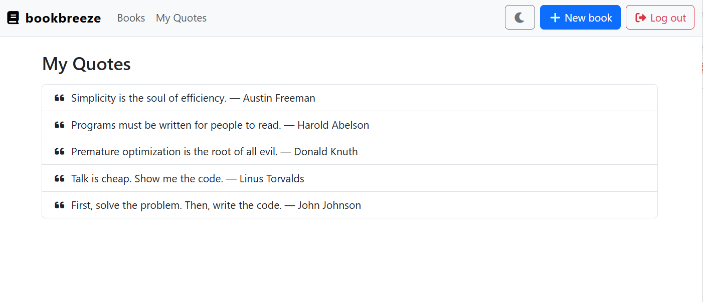

# Books App (Angular 20 + .NET 9)

A simple full‑stack example with an Angular frontend and a .NET 9 Minimal API backend. Authentication uses JWT. Books are stored in memory (no database).



## Structure
- `BooksApi/` – .NET 9 Minimal API (JWT auth, CRUD at `/api/books`)
- `books-app/` – Angular 20 SPA (login, books list/create/edit/delete, quotes, dark mode)

## Prerequisites
- Node.js + npm
- .NET 9 SDK
- Angular CLI (`npm i -g @angular/cli`)

## Features
- User authentication (login/register with JWT)
- Books & Quotes CRUD with ownership
- Toast notifications for user feedback  
- Responsive UI with dark/light mode
- Deployed full-stack (Vercel + Render)

## Run locally
**Backend**
```bash
cd BooksApi
dotnet run --urls "http://localhost:5000"
```

**Frontend**
```bash
cd books-app
npm install
ng serve
```
App: `http://localhost:4200`

## Updated Login Options
Now supports both:
- Demo account: `admin` / `pass123`
- Registered users: Create your own account via Register page

## Notes
- All CRUD endpoints require a valid JWT.
- CORS is enabled for local dev and for the deployed frontend.
- Production frontend should set `src/environments/environment.ts` → `apiBase` to the deployed API URL.

## Deploy (quick outline)
- **Frontend:** Vercel (Root Directory: `books-app`, Build: `ng build --configuration production`, Output: `dist/books-app/browser`)
- **Backend:** Render Web Service (Root Directory: `BooksApi`, Build: `dotnet publish -c Release -o out`, Start: `dotnet out/BooksApi.dll`). Set env vars:
  - `ASPNETCORE_URLS=http://0.0.0.0:${PORT}`
  - `ASPNETCORE_ENVIRONMENT=Production`
  - `Jwt__Key=<at least 32 chars>`
